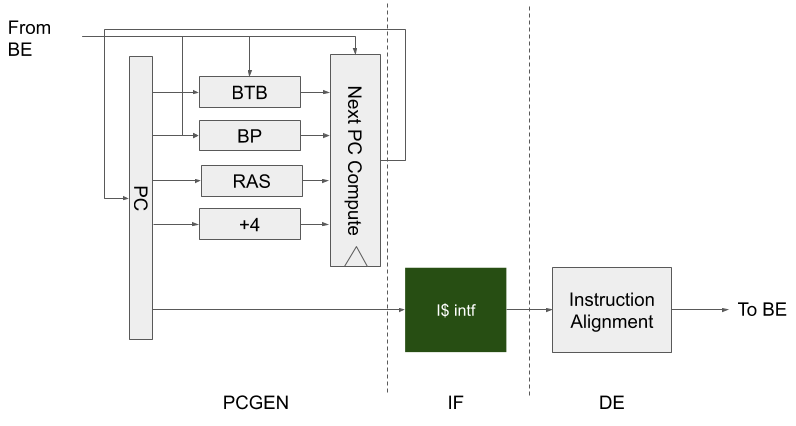
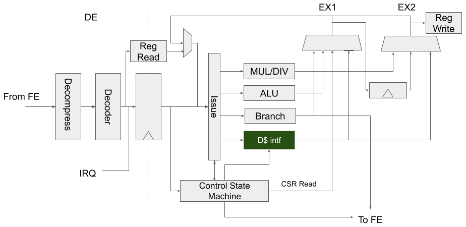

# Muntjac microarchitecture

Muntjac's 5 stage pipeline aims to be a good compromise between simplicity and performance.

## Components

Muntjac is designed to be modular to allow easy extension and modification. The main components are as follows:

 * Front-end (program counter generation, instruction fetch)
 * Back-end (decode, execute, memory access, write back)
 * Caches

So long as a module adheres to the required interfaces, it should be compatible.

 * [Pipeline <-> instruction cache](pipeline_icache_intf.md)
 * [Pipeline <-> data cache](pipeline_dcache_intf.md)
 * [Front-end <-> back-end](frontend_backend_intf.md)

### Front-end

The front-end's job is to provide a stream of instructions to the back-end.

The **PC gen stage** is unaware of compressed instructions. It always fetches an aligned 4-byte block of data. The decode stage is responsible for determining which bytes form the next instruction to be executed.

Branch prediction, a branch target buffer and a return address stack are all used to increase performance of the front-end.

### Back-end

The back-end's job is to execute instructions and handle their side effects.

There are **two execute stages**. All instructions are issued in EX1, but may complete in either EX1 or EX2, depending on the latency of the operation. This allows instructions to enter the execute stages, even if an existing instruction is taking a long time to complete. All instructions still commit in order.

The **control state machine** handles all exceptions/interrupts and SYSTEM instructions. These instructions are removed from the pipeline while being handled, and a dummy instruction is inserted into the pipeline when handling is complete. One exception to this is exceptions caused by data cache access. These happen too late to enter the control state machine, and instead cause all in-flight instructions in the back-end to set their target registers to `0` before otherwise completing as normal.
